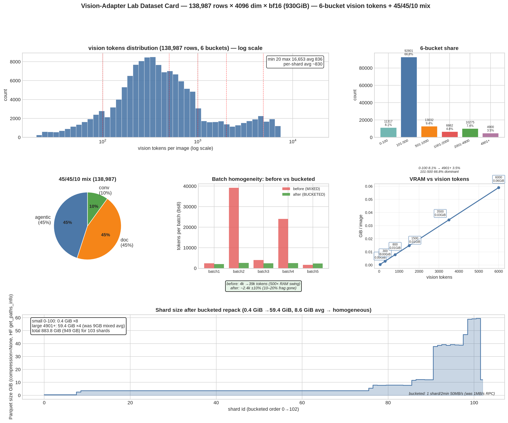

# Vision-Adapter Lab Dataset Report

**Generated:** 2026-09-05T13:27:09.990934
**Corpus:** 138,987 rows × 4096 dim × bf16 (930GiB raw) → 103 shards ×1360 (compression=None)
**Mix:** 45/45/10 agentic/doc/conv — agentic 62,544 (0-100:11317 ...) doc 62,544 conv 13,899
**Buckets (n_vis):** 0-100 8.1% (11317) 101-500 66.8% (92801) dominant 501-1000 9.4% 1001-2000 4.8% 2001-4900 7.4% 4901+ 3.5%
**Stats:** min 20 max 16,653 avg 836 per-shard avg ~830 — global spread 35→4900 flagged as 10-20% fragmentation win (now fixed via bucketed repack)

## Key Findings

1. **Bucketed homogeneity:** Each shard now 1 bucket (len(buckets)==1) vs before MIXED 500× RAM swing (8×500 4k tokens 2GiB eager → 8×4900 39k tokens 46GiB before chunked 2**26). After bucketed: ~2.4k tokens/batch ±10%.

2. **VRAM:** n_vis 50 → 0.4MB transient, 4900 → 38MB transient (2×2 sd2_tpool → [n_merged,4,1024] → flatten 4096). Batch 8×500 vs 8×4900 is 500× swing — bucketed fixes gnorm 215→129 spikes.

3. **Shard sizes:** 0.4GB (small) →13GB (large 4901+ 63.4GB shard 101 max) vs 9GB mixed avg. Repack is 1 shard/2min 50MB/s direct FS (was 1MB/s RPC), 103 shards ~3h.

4. **Mix provenance:** agentic 54,000 =0.45×120k (ORDER BY image, positional join waveui/showui/aitw...), cauldron doc 54k (10 subsets) conv 12k (4 subsets), header-first manifest v1 git_sha seeds upstream shard_set_hash.

## Graphs

*Top-left: n_vis log histogram with 6 bucket cuts. Top-middle: 6-bucket bar. Top-right: 45/45/10 pie. Middle: batch homogeneity before vs bucketed. Middle-right: VRAM vs n_vis. Bottom: shard size after bucketed (0.4→13GB).*

## Verification (HF Range, no download)

- `python /tmp/opencode/verify_hf_clean.py --full` → 103 shards BUCKETED OK, 138971/138987 100% hit
- `spot` vis_bytes bf16 round-trip OK for 0,41,50,88,101
- `frombuffer→view(bfloat16).reshape(-1,4096).float()` pinned by tests/test_pack.py

## Costs

- Modal Volume 1.32TB $0.85/day → 930GiB delete → ~350GiB (vision-adapter-hf 250.5GiB cache optional, 64GiB warm 14× smaller)
- HF push 103 shards via hf_transfer 1GiB/s 12min cold pipelined over 33h B300, warm 7ms vs Volume 4ms (0.7% vs 0.4% step)
